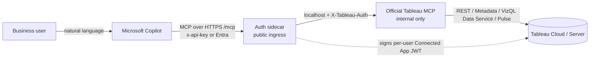

> **CRITICAL — credentials & identity are a security boundary.**
> This skill emits **deployment parameters and configuration only**. It never stores or commits
> a Tableau Connected App secret or `sidecarApiKey`. The user creates the Connected App, supplies
> the four secret values at deploy time, and controls who can call the endpoint. On any
> credential / sign-in error, **stop and have the user fix the Connected App or key** — never
> weaken auth (e.g. `service_account` is a *fallback for convenience*, never an auto-downgrade
> from a failed `passthrough`).

# Tableau MCP on Microsoft — Landing-Zone Deployment Skill

This skill packages **Play 1** of the Tableau → Fabric bridge as a reusable agent skill. Its job
is **procedural**: stand up the official Tableau MCP server in the user's Azure tenant behind an
auth sidecar, wire it into Microsoft Copilot, and operate it — so a business user can ask
*"what were total sales by region in Superstore?"* in Copilot and get a live answer from Tableau.

**We wrap, not fork.** The official image (`ghcr.io/tableau/tableau-mcp`) runs unmodified, so the
deployment inherits Tableau's ongoing updates and its full supported tool set (datasources, VizQL
Data Service queries, workbooks, views, Pulse, content search — ~20 tools, curated down by default).

## Architecture

Both containers run in **one** Azure Container App. Only the sidecar is exposed; the official
server listens on localhost, so the sidecar is the complete auth boundary (which is why the
official server's `DANGEROUSLY_DISABLE_OAUTH=true` is safe).

## Deployable assets — vendored in `assets/` (self-contained)

This skill is the **navigator/operator**, and it ships a self-contained copy of the deploy bundle
under [`assets/`](assets/) so you can deploy without cloning anything else. Paths below are relative
to this skill folder. The **heavy sidecar source** is *not* vendored — it's referenced in the bridge
repo (last row).

| Asset | Path | Purpose |
|---|---|---|
| Azure landing zone (Bicep) | [`assets/azure/main.bicep`](assets/azure/main.bicep) | Container App + sidecar + official image, identity wiring, optional Key Vault / Easy Auth. |
| Portal template (compiled) | [`assets/azure/azuredeploy.json`](assets/azure/azuredeploy.json) | Backs the **Deploy to Azure** button. |
| Parameters template | [`assets/azure/main.parameters.json`](assets/azure/main.parameters.json) | Param shape (placeholders only — **never** put secrets here). |
| CLI deploy | [`assets/azure/deploy.ps1`](assets/azure/deploy.ps1) | `az`-based deploy (PAT-free; prints `mcpEndpoint` + `healthUrl`). |
| Local harness | [`assets/local/docker-compose.yml`](assets/local/docker-compose.yml) + [`.env.example`](assets/local/.env.example) | Official image behind the **published** sidecar image for evaluation. |
| Copilot Studio connector | [`assets/copilot-studio/mcp-connector.swagger.yaml`](assets/copilot-studio/mcp-connector.swagger.yaml) + [`README.md`](assets/copilot-studio/README.md) | Custom-connector swagger + wiring guide. |
| Deploy verifier | [`scripts/verify_deployment.py`](scripts/verify_deployment.py) | Stdlib fail-loud check: health + auth-enforced + MCP handshake. |
| Auth sidecar (source + 31 tests) | bridge repo → [`Play1/sidecar/`](https://github.com/Yarbrdab000/Tableau-Fabric-AI-Bridge/tree/main/Play1/sidecar) | Starlette reverse proxy (`proxy.py`, `identity.py`, `config.py`, `tests/`). Built/published as the sidecar image; clone only to develop or test the source. |

> **Provenance:** the `assets/` bundle is synced from the bridge repo's `Play1/deploy/` (the upstream
> source of truth for the infra). See [`assets/README.md`](assets/README.md).

> **Out of scope:** the *no-MCP* route (a Logic App + OpenAPI tool, in the bridge repo's
> `Play1_no_MCP/`) is a separate connectivity option and is **not** this skill. If the user wants the
> no-code/Logic-App path, point them at the bridge repo instead.

## Prerequisites — establish these FIRST

Before deploying, confirm the user has (ask if unknown — do not assume):

1. **A Tableau Connected App (Direct Trust)** on their Tableau Cloud/Server site, **Enabled**,
   with scopes `tableau:content:read` + `tableau:viz_data_service:read` (+ `tableau:insights:read`
   only if exposing Pulse). This yields **Client ID**, **Secret ID**, **Secret Value** (shown once),
   and the **site content URL** (slug). See [identity-modes.md](resources/identity-modes.md).
2. **An Azure subscription** + permission to create a resource group / Container Apps.
3. **A target identity mode** — `service_account` (default, simplest) or `passthrough` (per-user
   RLS). Choose deliberately; see the Identity Modes table below.
4. For Copilot wiring: a **Copilot Studio** environment (or M365 Copilot with agent extensibility)
   with **generative orchestration ON** (MCP tools are ignored under classic orchestration).

If the user only says "set up Tableau in Copilot" without specifics, **ask which identity mode**
and whether they want **Azure** (production) or **local docker-compose** (evaluation) first.

## Information to collect (intake checklist)

Gather these **before** deploying. When the agent is driving an interactive deploy, ask for them
one at a time and let the user paste each value as they obtain it. **Secrets (the Connected App
Secret Value and the Sidecar Api Key) are entered at deploy time and must never be written to a
committed file, the model, or chat history.**

| # | Value | How to get it | Example |
|---|---|---|---|
| 1 | **Tableau pod URL** (`tableauServer`) | The host of your Tableau Cloud/Server URL (everything before `/#/site/...`). | `https://10ay.online.tableau.com` |
| 2 | **Site content URL** (`tableauSite`) | The slug after `/site/` in your Tableau URL. Default site = empty string. | `acme-analytics` |
| 3 | **Connected App Client ID** | Tableau → **Settings → Connected Apps → New Connected App → Direct Trust**; create it, set **Enabled**. Shown on the app. | `a1b2c3d4-…` |
| 4 | **Connected App Secret ID** | On the same app, **Generate New Secret** → copy the Secret ID. | `e5f6…` |
| 5 | **Connected App Secret Value** | Copied from the same **Generate New Secret** step — **shown once**. *(secret)* | `(one-time string)` |
| 6 | **Scopes enabled** | On the Connected App, enable `tableau:content:read` + `tableau:viz_data_service:read` (+ `tableau:insights:read` only for Pulse). | — |
| 7 | **Service account username** (`serviceAccountUsername`) | A **least-privilege** Tableau user the agent acts as (in `service_account` mode every Copilot user queries as this user). Not a Site Admin in prod. | `svc-mcp@acme.com` |
| 8 | **Identity mode** (`identityMode`) | `service_account` (default) or `passthrough` (per-user RLS). See [identity-modes.md](resources/identity-modes.md). | `service_account` |
| 9 | **Sidecar Api Key** (`sidecarApiKey`) | **Invent** a long random string (e.g. a GUID). You'll paste it into Copilot Studio later. PowerShell: `(New-Guid).Guid`. *(secret)* | `3f2a…-guid` |
| 10 | **Azure subscription** | Confirm `az account show`; switch with `az account set --subscription <id>` if needed. | — |
| 11 | **Resource group** + **region** | An existing RG or one to create (`az group create -n <rg> -l <region>`). | `my-rg`, `eastus` |
| _passthrough only_ | **Entra tenant id / client id** (`entraTenantId`, `entraClientId`) + **UPN mapping** (`upnMappingMode` + domains) | Pre-create an Entra app registration for Easy Auth; pick `direct`/`transform`/`explicit` mapping. See [identity-modes.md](resources/identity-modes.md). | `<tenant-guid>`, `<app-guid>` |

> **Verify the inputs work before standing up Azure (optional but recommended):** the
> `tableau-datasource-profiler` skill uses the *same* Connected App (Direct Trust JWT) — a quick
> profile of one datasource confirms the Client ID / Secret / scopes are valid before you deploy.

## Workflow Selector

| The user wants to… | Workflow | Resource |
|---|---|---|
| Deploy to Azure (button or CLI), get the MCP endpoint | **Deploy the landing zone** | [deploy-azure.md](resources/deploy-azure.md) |
| Choose / configure `service_account` vs per-user-RLS `passthrough`, map Entra UPN → Tableau user | **Configure identity** | [identity-modes.md](resources/identity-modes.md) |
| Register the endpoint in Copilot Studio and test NL queries | **Wire into Copilot Studio** | [copilot-studio-wiring.md](resources/copilot-studio-wiring.md) |
| Wire the endpoint into a code-running Copilot (Copilot CLI / Claude Code / Cursor) | **Wire into code Copilots** | [mcp-clients.md](resources/mcp-clients.md) |
| Run the real stack locally for evaluation; run sidecar tests | **Local dev / evaluate** | [local-dev.md](resources/local-dev.md) |
| Harden with Entra Easy Auth, rotate the API key, curate tools, troubleshoot | **Secure & operate** | [security-operations.md](resources/security-operations.md) |

## Identity Modes

| `identityMode` | What each agent user sees | Per-user RLS | Requirements |
|---|---|---|---|
| `service_account` (default) | Everything the one configured Tableau account can see | No | Works in any tenant; no Entra wiring. Use a **least-privilege** Tableau user (a Site Admin bypasses RLS). |
| `passthrough` | Only the rows *their own* Tableau user may see | **Yes** | Easy Auth (or APIM) in front + a UPN → Tableau username mapping. **Fail-closed**: unmapped callers are denied, never downgraded to the service account. |

## Key deployment parameters

Full list is in [`assets/azure/main.bicep`](assets/azure/main.bicep).

| Parameter | Purpose |
|---|---|
| `tableauServer` / `tableauSite` | Tableau pod URL + site content URL (slug). |
| `connectedAppClientId` / `connectedAppSecretId` / `connectedAppSecretValue` | Connected App (Direct Trust). Secret values are entered at deploy time, never committed. |
| `serviceAccountUsername` | Tableau user the service account acts as (required by the official server at startup; the identity used in `service_account` mode). |
| `allowApiKey` / `sidecarApiKey` | Enable + set the shared `x-api-key` for Copilot Studio. |
| `identityMode` | `service_account` (default) or `passthrough`. |
| `upnMappingMode` (+ `upnDomainFrom`/`upnDomainTo`) | Entra UPN → Tableau username (`direct` / `transform` / `explicit`). |
| `enableEasyAuth` (+ `entraClientId`, `entraTenantId`) | Microsoft Entra "Easy Auth" front door. |
| `useKeyVault` | Store secrets in Key Vault via managed identity instead of plain Container App secrets. |
| `includeTools` / `maxResultLimits` | Tool curation (default `datasource,content-exploration` + `query-datasource:100`). |
| `tableauMcpImage` / `sidecarImage` | Pinned image references (pin the official image by **digest** for production). |

Deploy **outputs** to capture: `mcpEndpoint` (register in Copilot), `healthUrl` (smoke check →
`{"status":"ok"}`), `identityModeOut`, `easyAuthEnabled`.

## Must / Prefer / Avoid

### MUST
- **Create + scope the Connected App before deploying.** Enable it; grant only the scopes needed.
- **Treat `sidecarApiKey` and the Connected App secret as secrets** — supply them at deploy time
  (portal form / CLI args) or via a **git-ignored** local parameters file; never commit them (not even
  in `assets/azure/main.parameters.json`), never echo them into the model/report or chat history, and
  never paste them into `az ... --debug` output.
- **Keep the official server internal-only.** Ingress targets the sidecar; the official container
  must have no public ingress. Never expose port 8000.
- **Fail closed in passthrough.** If a caller's UPN can't be mapped, the request is denied. Do not
  configure a silent fallback to the privileged service account.
- **Pin images by digest for production.** Deploy `tableauMcpImage` / `sidecarImage` as
  `…@sha256:<digest>`, not a moving tag, so a deploy can't silently pull a changed image.
- **Verify after deploy** — hit `healthUrl` (expect `{"status":"ok"}`) and run one NL query in
  Copilot's test pane before declaring success.

### PREFER
- **`service_account` for the first deploy / demo** (no Entra wiring), then graduate to
  `passthrough` once RLS is defined on the datasources and users exist on the Tableau site.
- **Least-privilege Tableau identities** — a least-privilege service account, and in passthrough,
  impersonated users that are **not** Site Admins (admins bypass RLS).
- **Curate tools** (`includeTools` / `maxResultLimits`) — fewer, well-described tools orchestrate
  more reliably on weaker models.
- **Key Vault (`useKeyVault=true`) + Entra Easy Auth** for production hardening.

### AVOID
- **Do not fork or rebuild the official MCP image** — wrap it; you inherit Tableau's updates.
- **Do not trust client-supplied identity headers** — the sidecar strips `X-Tableau-Auth` /
  `X-MS-CLIENT-PRINCIPAL*`; only trust Easy Auth's principal when `TRUST_EASY_AUTH=true` behind a
  real gateway. (Locally, that header is spoofable — local passthrough is for testing only.)
- **Do not use a Site Admin as the service account** in production — it bypasses RLS and sees all data.
- **Do not confuse this with `Play1_no_MCP/`** (the Logic App route) or with the migration skills.

## Validation & Testing

- **Deploy verifier (recommended):** `python scripts/verify_deployment.py --base-url <mcpEndpoint without /mcp>`
  with the API key in `SIDECAR_API_KEY` — asserts `/healthz` ok, that unauthenticated `/mcp` is
  rejected, and that the MCP handshake lists tools. See [local-dev.md](resources/local-dev.md).
- **Sidecar tests (offline, no Docker):** clone the bridge repo, then from `Play1/sidecar/`,
  `python -m pytest tests -q` (31 tests against an in-process mock upstream — auth, header stripping,
  identity mapping, proxy).
- **Local smoke (Docker):** from `assets/local/`, `docker compose up` then
  `curl -s localhost:9000/healthz`.
- **Azure smoke:** open `healthUrl` from the deployment outputs (expect `{"status":"ok"}`); then a
  Copilot test prompt that calls `list-datasources` / `query-datasource`.

## Related skills

- **`tableau-datasource-profiler`** — same Connected App / VDS world; profile or NL-query a
  datasource directly (read-only) without standing up the server. Good for validating the
  Connected App works before/after deploy.
- **`tableau-migration`** — once you can query Tableau live, rebuild its datasources as Fabric /
  Power BI semantic models.
